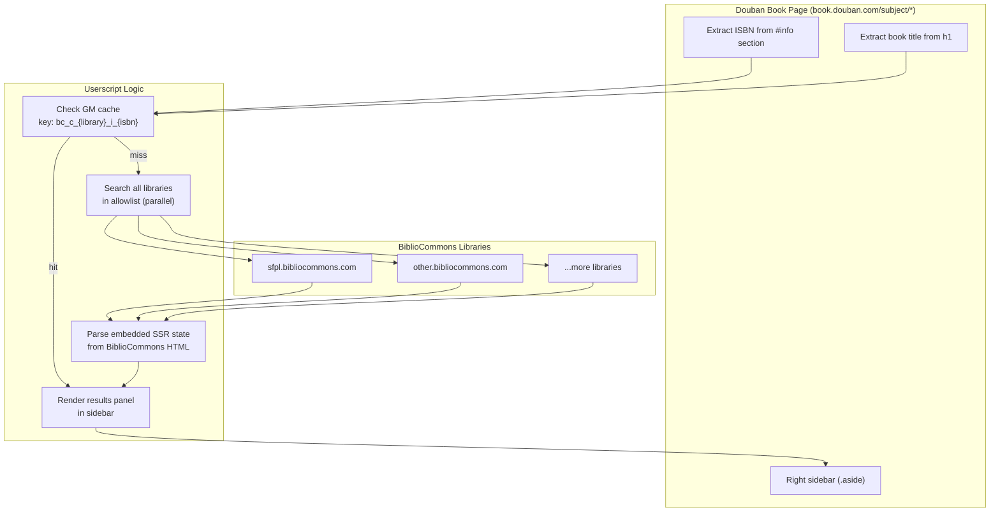

# BiblioCommons Search in Douban - Tampermonkey Plugin

## Overview

A Tampermonkey userscript that runs on Douban book pages (`book.douban.com/subject/*`), extracts ISBN, searches multiple BiblioCommons library catalogs in parallel, and displays aggregated results in the right sidebar. Companion to [douban-bibliocommons-rating](../douban-bibliocommons-rating/) which does the reverse (shows Douban ratings on BiblioCommons).

## Architecture

## Key Decisions

### 1. Douban Page Data Extraction

- **ISBN**: Parsed from `#info` section by finding `` containing "ISBN" and reading the adjacent text node. Fallback regex on full `#info` text.
- **Title**: From `document.querySelector('#wrapper h1 span[property="v:itemreviewed"]')` with fallback to any `h1 span`.

### 2. BiblioCommons Search Strategy

Uses `GM_xmlhttpRequest` to fetch search page HTML, then parses the embedded SSR state from `<script data-iso-key="_0">` to extract `entities.bibs`. Same state structure used by the companion project.

- Search URL: `https://{subdomain}.bibliocommons.com/v2/search?query={isbn}&searchType=smart`
- Title fallback URL: same pattern with book title as query

### 3. Result Panel UI

Injected as **first child** of `.aside` on Douban book pages.

- **Header**: "Library Search" with refresh (↻) and settings (⚙) buttons
- **Per-library row**: Library name, status indicator, link to catalog
- **3 detail levels** (user-toggleable, stored in GM_setValue):
  - **Simple**: library name + ✓ Found / Not found + link
  - **Medium**: library name + N found + link
  - **Detailed**: library name + count + format types (Book, eBook, etc.) + link
- **No results**: "Search by Title" button → inline re-search by title
- **Loading**: Pulsing "searching…" animation per row

### 4. Library Allowlist

Stored in `GM_setValue('bc_libraries', JSON.stringify([...]))`. Default: `[{ name: 'SFPL', subdomain: 'sfpl' }]`.

Two access points:
1. **In-page**: Gear icon in panel header → inline settings form
2. **Tampermonkey menu**: `GM_registerMenuCommand('Manage Libraries', ...)` → same panel

### 5. Caching

- **Key pattern**: `bc_c_{subdomain}_i_{isbn}` (ISBN) or `bc_c_{subdomain}_t_{normalizedTitle}` (title)
- **TTL**: 24 hours
- **Storage**: `GM_getValue` / `GM_setValue`
- **Refresh**: Refresh button bypasses cache via `forceRefresh` flag

## Output

Single file: `bibliocommons-search.user.js` — ready for Tampermonkey installation.
